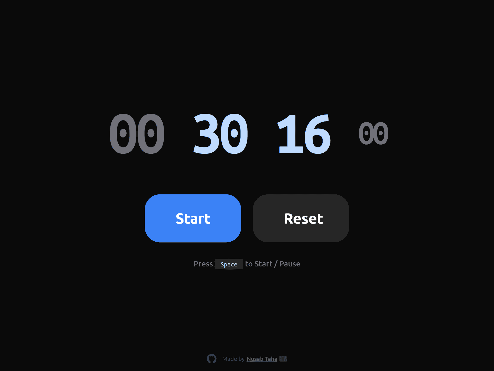

# Clocked

It's so unacceptable that there is not a single simple stopwatch that I could find (for web).

The default one which google shows doesn't stay in full screen and doesn't stay persistant throught reloads. The other ones are just light themed junks that take up more focus than the timer.

So here's this simple stopwatch website without any junks.

Live at: https://clocked.pages.dev/

